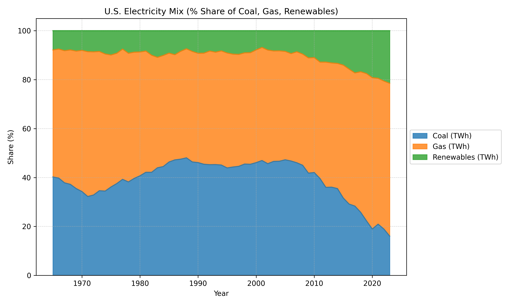
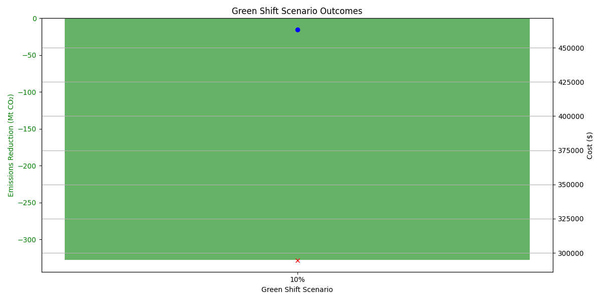

# ESG Tracker: U.S. Energy Forecasting & CO₂ Simulation System

This project forecasts U.S. gas consumption, CO₂ emissions, and energy mix trends using time series models (ETS & ARIMA). It simulates carbon impact scenarios with customizable green energy shifts and outputs visual and textual insights for ESG and policy evaluation.

---

## 🔧 Features

- 📈 **Time Series Forecasting** using ETS and ARIMA models
- 🧪 **Diagnostics** (ACF, PACF, STL Decomposition)
- 🌿 **Scenario Simulation** for green energy adoption (5–30%)
- 📊 **Visualizations** for fuel mix, forecasts, and emissions shifts
- 🧾 **Executive Summaries** (text-based and matrix format)
- ✅ **CLI Interactivity** for fast scenario testing

---

## 📁 Project Structure

```
├── main.py                     # CLI entry point
├── scenario_model.py           # Scenario simulation logic
├── ts_diagnostics.py           # Forecast diagnostics module
├── fuel_mix_share.py           # Fuel mix visualization
├── summary_generator.py        # Text summary generation
├── plot_scenario_matrix.py     # Scenario matrix visualization
├── us_energy_co2_merged.csv    # Cleaned dataset
├── us_gas_forecast_with_ci.csv # Gas forecast + confidence interval
├── scenario_summary.txt        # Text-based scenario results
├── scenario_matrix.csv         # Tabular scenario output
├── scenario_matrix_plot.png    # Scenario heatmap image
├── fuel_mix_share.png          # Fuel mix plot
├── gas_acf_pacf.png            # ACF/PACF diagnostics
├── .gitignore
└── README.md
```

---

## 🖥️ How to Run

```bash
python main.py                  # Run full pipeline
python main.py --scenario 10   # Run 10% green energy shift simulation
python main.py --skip-plots    # Skip plots for faster runs
python main.py --plot-scenarios # Plot scenario matrix
```

---

## 📊 Sample Output

### 🔹 Forecasted Gas Consumption


### 🔹 Fuel Mix Share



### 🔹 Scenario Simulation Matrix



---

## 📌 Key Metrics

From `summary.txt` and `scenario_summary.txt`:

- **Baseline CO₂ Intensity**: 0.297 Mt/TWh
- **Forecasted Gas Usage**: 7985.1 TWh
- **Scenario (10% Shift)**:  
  - Δ Emissions: −327.4 Mt CO₂  
  - Δ Intensity: −0.030 Mt/TWh  
  - Savings: $15,970  
  - CO₂ Tax Delta: $32,739  

---

## 📎 License

MIT License (or specify your preferred license)

---

## 🤝 Acknowledgments

Thanks to OWID for the CO₂ and energy datasets.